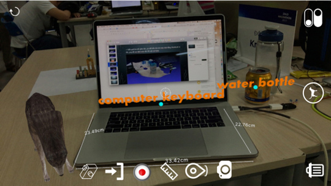

## Preview
 Demo(https://www.facebook.com/tuynu/videos/1132420913526928/)

# ARKit-Diazz

You can detect the plane then put mark, sticker, 3d model, particle, measurement

Project use pods so run "pod install" first
Download Inceptionv3.mlmodel from https://developer.apple.com/machine-learning/

Now this is messy project
I will update document later

Enjoy and have fun!
